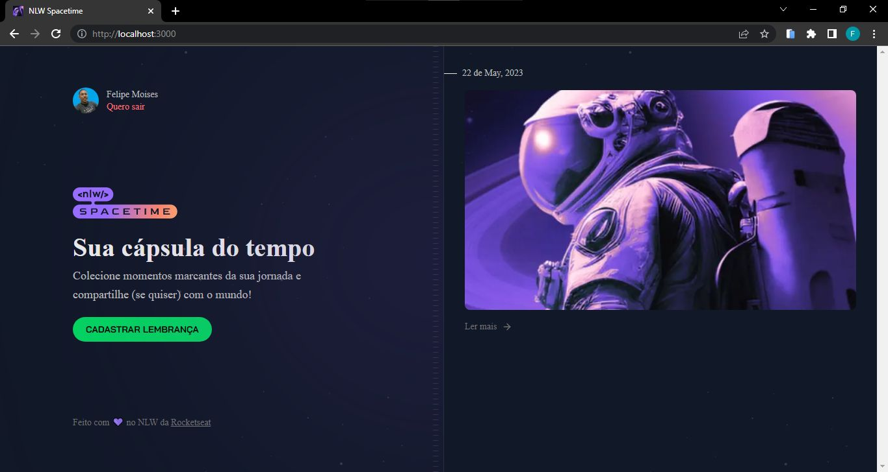

# Spacetime - Front-End

<div align="center">
  
</div>

## 1 - Sobre

Aplicação de recordação de memórias, onde o usuário poderá adicionar à uma timeline textos, fotos e vídeos de acontecimentos marcantes da sua vida, organizados por mês e ano.

---

## 2 - Tecnologias

Um pouco das tecnologias que foram utilizadas no projeto: 

- NextJS
- TypeScript
- Tailwind CSS
- Axios

---

## 3 - Instalação e uso

### Requisitos:
- [NodeJS](https://nodejs.org/en/)
- [Npm](https://www.npmjs.com) ou [yarn](https://yarnpkg.com)

Clone o projeto em sua máquina e instale as dependências com o comando:

```shell
yarn
ou
npm install
```

---

Em seguida, crie um arquivo **.env.local**, copiando o formato do arquivo **.env.local.example**:

```
env.local.example -> .env.local
```

A aplicação está rodando em servidor local, por tanto, execute a [API](https://github.com/felipems1/spacetime-server) localmente para testar a aplicação. Para rodar o servidor Back-End basta seguir as instruções deixada no readme da API mencionada.

---

Com todas as dependencias devidamente instaladas, basta rodar o seguinte comando:

```shell
yarn dev
ou
npm run dev
```

<p align="center">Projeto feito com ❤️ por <a href="https://www.linkedin.com/in/felipemoises12/">Felipe Moises</a></p>