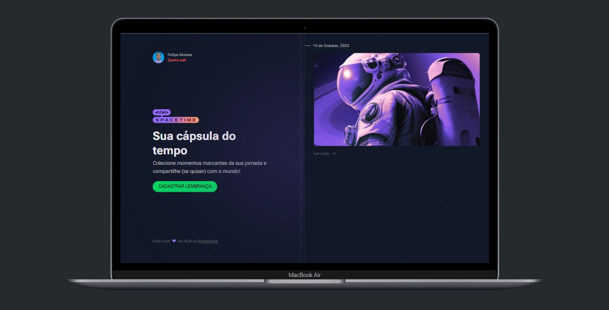

<h1 align="center"> Spacetime - Front End </h1>

<div align="center">
  
</div>

## 1 - Sobre

Aplicação de recordação de memórias, onde o usuário poderá adicionar à uma timeline textos, fotos e vídeos de acontecimentos marcantes da sua vida, organizados por mês e ano.

---

## 2 - Tecnologias

Um pouco das tecnologias que foram utilizadas no projeto:

- NextJS
- TypeScript
- Tailwind CSS
- Axios

---

## 3 - Rodando o projeto:

Você precisa ter o [Node](https://nodejs.org/en/), o [Git](https://git-scm.com/) e algum gerenciador de pacotes([NPM](https://docs.npmjs.com/downloading-and-installing-node-js-and-npm/) | [Yarn](https://classic.yarnpkg.com/lang/en/docs/install)) instalados em sua máquina.

A aplicação está rodando em servidor local, por tanto, execute a [API](https://github.com/felipems1/spacetime-server.git) localmente para testar a aplicação. Para rodar o servidor BackEnd basta seguir as instruções deixada no readme da API mencionada.

```bash
1. Clone o repositório:
$ git clone https://github.com/felipems1/spacetime-web.git

2. Acesse a pasta e instale as dependências via terminal:
$ yarn install / npm install

3. Em seguida, crie um arquivo .env.local, copiando o formato do arquivo .env.local.example:
$ .env.local.example -> .env.local

4. Inicie a aplicação em modo de desenvolvimento:
$ yarn dev / npm run dev

5. O servidor será aberto em http://localhost:3000
```

<p align="center">Projeto feito com ❤️ por <a href="https://www.linkedin.com/in/felipems12/">Felipe Moises</a></p>
